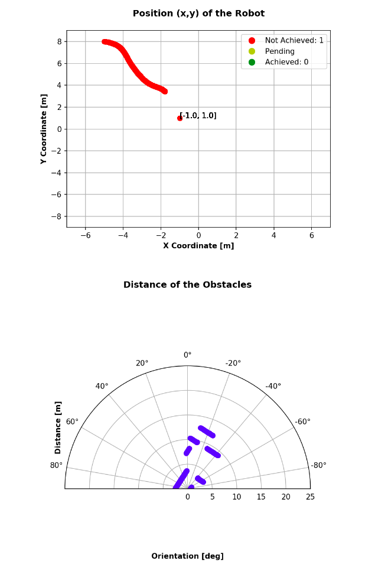

# RT2_JupyterNotebook

###  Professor [Carmine Recchiuto](https://github.com/CarmineD8),  Student: [Subhransu Sourav Priyadarshan](https://github.com/subhransu10)

## AIM 
 The aim of this assignment is to create a jupyter notebook to replace the user interface that we created in the [RT 1 -Assignment 3](https://github.com/subhransu10/RT1_Assignment3) keeping in mind that we need to control the robot in all the three modalities.

__NOTE__: I used "widgets" to let the user know the distance and the “direction” of the closest obstacle

## Installation and Running
In order to create the Jupyter Interface, we install it and start following the commands below:
```bash
pip3 install jupyter bqplot pyyaml ipywidgets
```
```bash
jupyter nbextension enable --py widgetsnbextension
```
```bash
jupyter notebook --allow-root
```

## Code Description of Jupyter
As we already stated above that we need to control the robot behavior. To get a brief overview of the aim of the third assignment of [Research Track1](https://github.com/subhransu10/RT1_Assignment3)

### 1. Initialization of the nodes and Buttons of UI (after importing libraries)
```python
rospy.init_node('jupyter')


b1 = Button(description='First Modality',layout=Layout(width='auto', align="center", grid_area='b1'),style=ButtonStyle(button_color='lightblue'))
b2 = Button(description='Second Modality',layout=Layout(width='auto', grid_area='b2'),style=ButtonStyle(button_color='moccasin'))
b3 = Button(description='Third Modality',layout=Layout(width='auto', grid_area='b3'),style=ButtonStyle(button_color='salmon'))
b4 = Button(description='Quit Modality',layout=Layout(height='auto', grid_area='b4'),style=ButtonStyle(button_color='salmon'))

ok_btn=Button(description='OK',layout=Layout(width='auto', grid_area='ok'),style=ButtonStyle(button_color='salmon'))

#Modality 2 and 3
t1 = Button(description='Left',layout=Layout(width='auto', grid_area='t1'),style=ButtonStyle(button_color='lightblue'))
t2 = Button(description='Forward',layout=Layout(width='auto', grid_area='t2'),style=ButtonStyle(button_color='moccasin'))
t3 = Button(description='Right',layout=Layout(width='auto', grid_area='t3'),style=ButtonStyle(button_color='salmon'))
t4 = Button(description='Stop Motors',layout=Layout(height='auto', grid_area='t4'),style=ButtonStyle(button_color='salmon'))
t11 = Button(description='Front-Left',layout=Layout(width='auto', grid_area='t11'),style=ButtonStyle(button_color='lightblue'))
t12 = Button(description='Front-Right',layout=Layout(width='auto', grid_area='t12'),style=ButtonStyle(button_color='moccasin'))
t13 = Button(description='Back-Left',layout=Layout(width='auto', grid_area='t13'),style=ButtonStyle(button_color='lightblue'))
t14 = Button(description='Back',layout=Layout(width='auto', grid_area='t14'),style=ButtonStyle(button_color='moccasin'))
t15 = Button(description='Back-Right',layout=Layout(width='auto', grid_area='t15'),style=ButtonStyle(button_color='lightblue'))

t5 = Button(description='Left ',layout=Layout(width='auto', align="center", grid_area='t5'),style=ButtonStyle(button_color='lightblue'))
t6 = Button(description='Forward ',layout=Layout(width='auto', grid_area='t6'),style=ButtonStyle(button_color='moccasin'))
t7 = Button(description='Right',layout=Layout(width='auto', grid_area='t7'),style=ButtonStyle(button_color='salmon'))
t8 = Button(description='Stop Motors',layout=Layout(width='auto', grid_area='t8'),style=ButtonStyle(button_color='salmon'))
t21 = Button(description='Front-Left',layout=Layout(width='auto', grid_area='t21'),style=ButtonStyle(button_color='lightblue'))
t22 = Button(description='Front-Right',layout=Layout(width='auto', grid_area='t22'),style=ButtonStyle(button_color='moccasin'))

tdecv=Button(description='Decrease Velocity ',layout=Layout(width='auto', align="center", grid_area='tdecv'),style=ButtonStyle(button_color='lightblue'))
tincv=Button(description='Increase Velocity ',layout=Layout(width='auto', align="center", grid_area='tincv'),style=ButtonStyle(button_color='lightblue'))


mb = {
        'i':(1,0,0,0),
        'o':(1,0,0,-1),
        'j':(0,0,0,1),
        'l':(0,0,0,-1),
        'u':(1,0,0,1),
        ',':(-1,0,0,0),
        '.':(-1,0,0,1),
        'm':(-1,0,0,-1),
        
    }

speed=1.0
incSpeed=1.1
decSpeed=0.9


from teleop import PublishThread
repeat = rospy.get_param("~repeat_rate", 0.0)
pub_thread = PublishThread(repeat)
pub_thread.wait_for_subscribers()
sub = rospy.Subscriber('/scan', LaserScan, clbk_laser) #subscription to /scan topic    

des_pos_x=widgets.FloatText(
    value=0.0,
    description='x coordinate:',
    disabled=False
)
des_pos_y=widgets.FloatText(
    value=0.0,
    description='y coordinate:',
    disabled=False
)
```
### 2.Create publishers for changing the modality and sending goal coordinates
```python
pubModality=rospy.Publisher('mode',Int32,queue_size=10) #publisher of 'mode' topic, sends user choice to other nodes
pubGoalPos=rospy.Publisher('goalpos',Vector3,queue_size=10) #publisher of 'goalpos' topic, sends the desired position
x=0.0
y=0.0
goals=[]
```
### 3.Description of the code for the Graphical Representation of the Robot's Odometry & Laser Scanner
The function below shows the plotting of the data of the __robot's odometry__ and __laser scanner__.
```python
colors=[]
x_fromAni=[]
y_fromAni=[]
legend_elements = [Line2D([0], [0],marker='o', color='w', label='Not Achieved: 0',
                          markerfacecolor='r', markersize=10),
                   Line2D([0], [0], marker='o', color='w', label='Pending',
                          markerfacecolor='y', markersize=10),
                    Line2D([0], [0], marker='o', color='w', label='Achieved: 0',
                          markerfacecolor='g', markersize=10)]

vis = Visualiser(x,y,goals,colors,legend_elements) #instance of Visualiser class
subOdom = rospy.Subscriber('/odom', Odometry, vis.clbk_odom) #subscription to '/odom' topic
subScan = rospy.Subscriber('/scan', LaserScan, vis.clbk_scan) #subscription to '/scan' topic
subStatus=rospy.Subscriber('/move_base/status',GoalStatusArray,vis.clbk_status) #subscription to '/move_base/status' topic
subGoal=rospy.Subscriber('/move_base/goal',MoveBaseActionGoal,vis.clbk_goal) #subscription to '/move_base/goal' topic
```
## RESULTS
Below is the graphical representation of the robot's behavior during the Simulation.The graph at the top represents the laser scan on a polar graph representation whwereas the second graph represents the position described by the odometry topic of the robot. The graph shows the position of the robot in space with red dots.




## CONCLUSION AND SCOPE OF IMPROVEMENT

Some parameters can be changed since they may be not optimal. 
There are some particular improvenments that I want to highlight:

+ In __jupyter notebook data__, the real time data is updating using %matplotlib widget but at some stage it is lagging and due to this data updation also lagged. This can be improve in further imporvement of the code.

+ In the __assisted driving mode__, the robot avoid obstacles in the front/left/right related to its vision field, but since it can go also backwards it will inevitably damage the back side by not avoiding the wall. Probably by using the geometry and the space of the environment, we can solve this issue.

+ In the __reach point node__, we may compute the current position of the robot in the environment and match it to the goal position in order to have an instant feedback if the robot has reached the Point(x,y). The ROS topic base_scan/status takes a long time to control if the robot has reached the goal.


